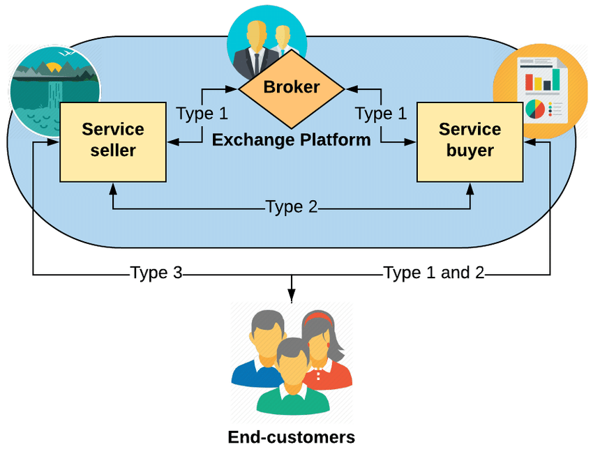

<a name="readme-top"></a>


<div align="center">
  
  <br/>

  <h3><b>Doctors Reservations Front end</b></h3>

</div>

<!-- TABLE OF CONTENTS -->

# 📗 Table of Contents

- [� Table of Contents](#-table-of-contents)
- [📖 Yuunga Front-end ](#-yuunga-front-end-)
  - [🛠 Built With ](#-built-with-)
    - [Tech Stack ](#tech-stack-)
    - [Key Features ](#key-features-)
  - [Doctors Reservations Backend](#doctors-reservations-backend)
  - [💻 Getting Started ](#-getting-started-)
    - [Prerequisites](#prerequisites)
    - [Setup](#setup)
    - [Install](#install)
    - [Usage](#usage)
    - [Run tests](#run-tests)
  - [👥 Authors ](#-authors-)
  - [🤝 Contributing ](#-contributing-)
  - [⭐️ Show your support ](#️-show-your-support-)
  - [🙏 Acknowledgments ](#-acknowledgments-)
  - [📝 License ](#-license-)

<!-- PROJECT DESCRIPTION -->

# 📖 Yuunga Front-end <a name="about-project"></a>


**Yuunga Front-end** is a Front-end implementation of the Yuunga App. Yuunga is a B2B platform that connects small businesses to their customers. It allows small businesses to create a profile and list their products and services. Customers can then search for businesses and products and services they offer. Customers can also leave reviews for businesses they have interacted with. Businesses can connect and interact with each other through the platform creating a consumption and supply network.

## 🛠 Built With <a name="built-with"></a>

### Tech Stack <a name="tech-stack"></a>


<details>
  <summary>Client</summary>
  <ul>
    <li><a href="https://reactjs.org/">React.js</a></li>
  </ul>
</details>

<details>
  <summary>Server</summary>
  <ul>
    <li><a href="https://rubyonrails.org/">Ruby on Rails</a></li>
  </ul>
</details>

<details>
<summary>Database</summary>
  <ul>
    <li><a href="https://www.postgresql.org/">PostgreSQL</a></li>
  </ul>
</details>

<!-- Features -->

### Key Features <a name="key-features"></a>


- **Business create profiles**
- **Businesses list their products and consumables.**
- **Customers search for business and products**
- **Location based search**
- **B2B network**

<p align="right">(<a href="#readme-top">back to top</a>)</p>

<!-- LIVE DEMO -->

## Doctors Reservations Backend

[Back End App](https://github.com/JonahKayizzi/Yunga-React-Rails-BackEnd)

<p align="right">(<a href="#readme-top">back to top</a>)</p>

<!-- GETTING STARTED -->

## 💻 Getting Started <a name="getting-started"></a>


To get a local copy up and running, follow these steps.

### Prerequisites

In order to run this project you need:


```sh
  npm install
  Nodejs
```


### Setup

Clone this repository to your desired folder:


```sh
  cd Yunga-React-Rails-Front-End
  git clone https://github.com/JonahKayizzi/Yunga-React-Rails-Front-End.git
```


### Install

Install this project with:


```sh
  cd Yunga-React-Rails-Front-End
  npm install
```


### Usage

To run the project, execute the following command:


```sh
  npm run start
```


### Run tests

To run tests, run the following command:


```sh
  npm run test
```


<p align="right">(<a href="#readme-top">back to top</a>)</p>


## 👥 Authors <a name="authors"></a>

👤 **Jonathan Kayizzi**

- GitHub: [@JonahKayizzi](https://github.com/JonahKayizzi)
- Twitter: [@JonahKayizzi](https://twitter.com/JonahKayizzi)
- LinkedIn: [LinkedIn](https://www.linkedin.com/in/jonathan-kayizzi/)

<p align="right">(<a href="#readme-top">back to top</a>)</p>


<!-- CONTRIBUTING -->

## 🤝 Contributing <a name="contributing"></a>

Contributions, issues, and feature requests are welcome!

Feel free to check the [issues page](https://github.com/JonahKayizzi/Yunga-React-Rails-Front-End/issues).

<p align="right">(<a href="#readme-top">back to top</a>)</p>

<!-- SUPPORT -->

## ⭐️ Show your support <a name="support"></a>


If you like this project you can give me a ⭐️

<p align="right">(<a href="#readme-top">back to top</a>)</p>

<!-- ACKNOWLEDGEMENTS -->

## 🙏 Acknowledgments <a name="acknowledgements"></a>


<p align="right">(<a href="#readme-top">back to top</a>)</p>


<!-- LICENSE -->

## 📝 License <a name="license"></a>


<p align="right">(<a href="#readme-top">back to top</a>)</p>
